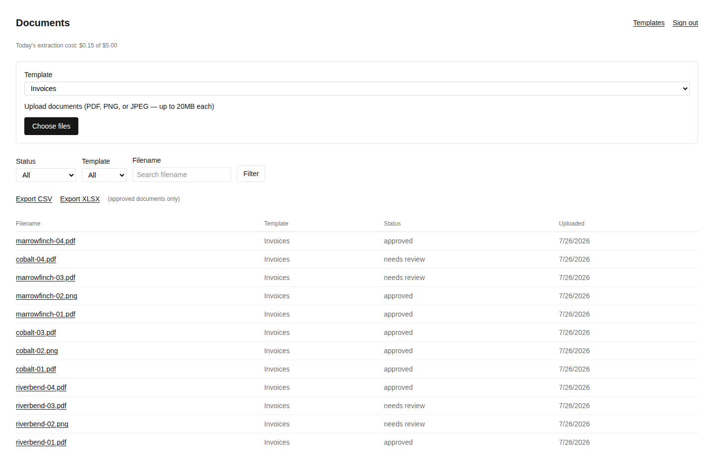
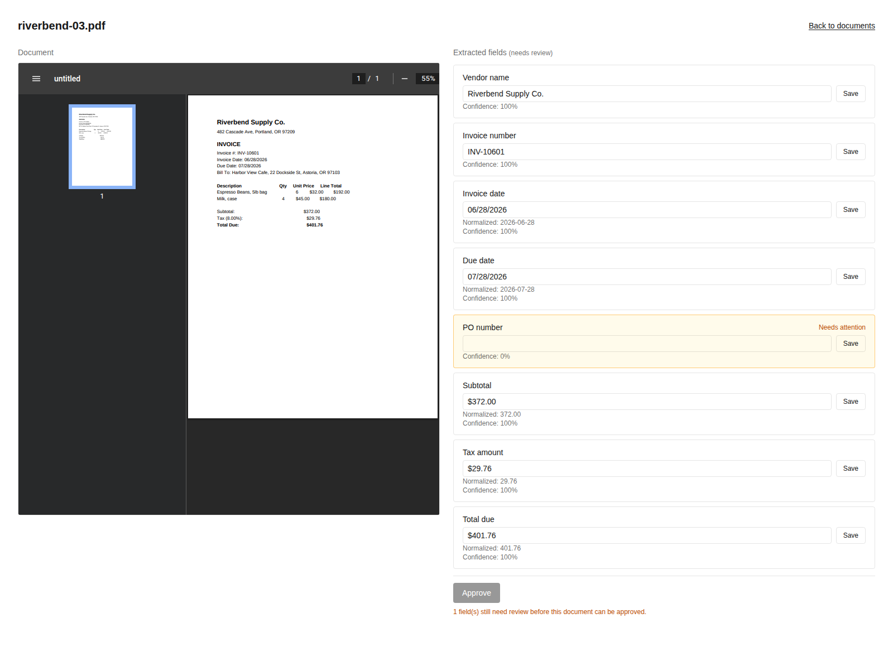
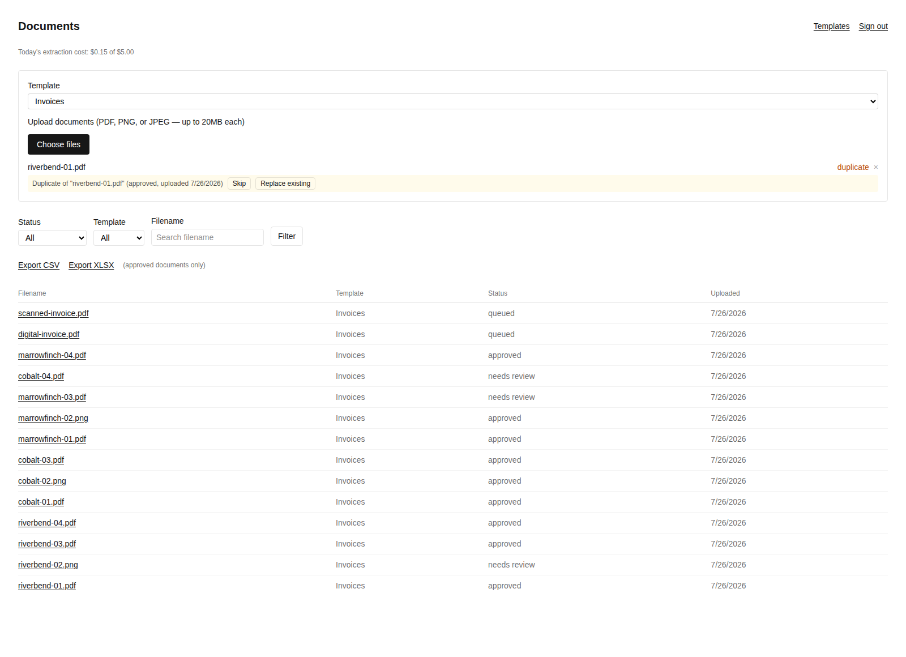
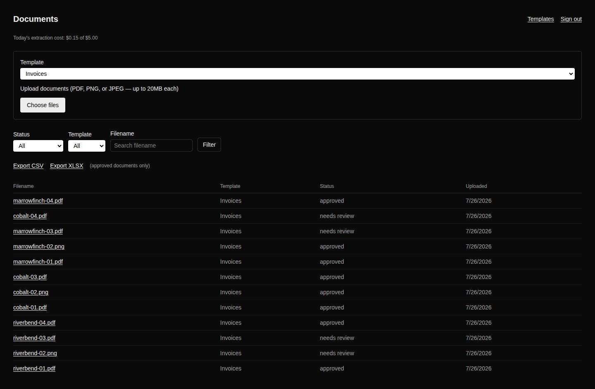

# Document Data Extractor

Batch-extract structured data from invoices — vendor, invoice number, dates, PO
number, subtotal, tax, total — using Claude, with **mandatory human review**
on anything the model isn't confident about before it ever reaches an export
file. Not a demo trick: the review gate is enforced at the database level, not
just hidden behind a UI flag.

**Live demo:** https://document-extractor-web-production.up.railway.app
Login: `demo@docextractor.example` / `DemoInvoice2026!`
The demo account is a shared, permanently read-only account — explore the
review workflow (flagged fields, the review queue, exports) freely, but writes
(uploads, corrections, approvals) won't persist. See [Demo account](#demo-account) below.

## What it does

1. **Upload** one or many invoices (PDF or image) against a reusable extraction
   template — a named set of fields to pull out (e.g. `vendor_name`,
   `invoice_number`, `subtotal`).
2. A background worker downloads each file, extracts text, and calls Claude
   with a per-field JSON schema built from the template.
3. Every extracted field gets a **confidence score** from a combination of the
   model's own confidence and a set of deterministic validators (date
   parsing, arithmetic checks like `subtotal + tax = total`, required-field
   checks, cross-field consistency).
4. Any field below the review threshold — or any document that fails a
   validator — routes the whole document to **Needs Review**, never a partial
   pass-through. A human corrects flagged fields (or confirms them) and
   explicitly approves.
5. Only **approved** documents are eligible for export, as CSV or XLSX, with
   corrected values in place of the original flagged ones.

## Screenshots

<p>
  
  
</p>
<p>
  
  
</p>

Full set of 16 screenshots (login, filters, scanned-image review, corrections,
approval, batch upload, duplicate replace, template CRUD and delete guard,
CSV/XLSX export, light and dark themes) in
[`docs/screenshots/`](docs/screenshots).

### Demo video

<video src="https://github.com/NovaVey/Document-Data-Extractor/raw/main/docs/demo.mp4" controls width="100%"></video>

(If the player above doesn't load, open [`docs/demo.mp4`](docs/demo.mp4)
directly.) A ~78s walkthrough: login, filter to Needs Review, correct and
approve a flagged field, upload a document, hit and resolve a duplicate,
attempt to delete an in-use template (blocked) and delete an unused one
(succeeds), then export.

## Why the review gate is real, not cosmetic

- The threshold and validators are unit-tested against a 10-invoice
  ground-truth fixture with hand-verified correct values, including
  deliberately adversarial cases (a skewed scan, a missing PO number, a
  "Due on receipt" non-calendar due date, a confident-but-wrong model
  answer that only a validator catches).
- `approve_document()` is a Postgres function, not an application-layer
  check — it enforces the same "nothing below threshold, uncorrected, gets
  approved" rule no matter which code path calls it.
- Row Level Security enforces per-organization data isolation and a
  separate read-only mode (used by the public demo account) at the
  database layer, not in application code that could be bypassed by a
  direct API call.

## Measured accuracy

Measured against the 10-document ground-truth fixture (`worker/scripts/check-ground-truth.mjs`):

| Metric | Result |
| --- | --- |
| Field accuracy | 80/80 fields matched (100.0%) |
| Synthetic error catch rate | 6/6 scenarios correctly routed to review (arithmetic mismatch, missing required field, unparseable date, date-order violation, low model confidence, multi-error document) |
| Review threshold | 0.9 by default (field-level; a document is never fully "clean" if *any* field is below this); overridable per deployment via `REVIEW_CONFIDENCE_THRESHOLD`, enforced by `approve_document()` regardless of which code path calls it |
| Cost per document | ~1.25¢ average (measured across 12 real documents through the deployed pipeline: min 1¢, max 2¢) |

Ground truth is correct by construction, so field accuracy measures
extraction quality on clean input — the synthetic error suite is what proves
the routing mechanism itself catches problems, independent of how often
real-world invoices happen to contain them.

## Demo account

The demo account (`demo@docextractor.example`) is real, permanently
persisted, and shared publicly — the whole point of a template is that
anyone can try it without their own Supabase/Anthropic setup. It's locked
read-only (`organizations.is_demo = true`) rather than reset periodically or
sandboxed per visitor: since it's a single shared account meant to see
unpredictable public traffic indefinitely, a writable shared account would
degrade continuously as visitors click around. You can browse the full
review workflow — 12 real invoices, 8 already approved, 4 left genuinely
flagged in `needs_review` — but Save/Approve/Upload/Delete won't take effect.

## Architecture

- **Web app** (`src/`) — Next.js 16 App Router, Supabase Auth (email/password),
  Server Actions for all mutations. Deployed as its own Railway service.
- **Worker** (`worker/`) — a standalone Node process that polls a Postgres-backed
  queue (`claim_next_document()`, an atomic claim function using
  `FOR UPDATE SKIP LOCKED`), downloads the file from Supabase Storage, extracts
  text, calls the Anthropic API, scores and validates the result, and writes
  it back. Crash-safe: a worker that dies mid-document leaves the row
  reclaimable by the next poll after a timeout, never stuck. Deployed as a
  second Railway service, same repo, `rootDirectory: worker`.
- **Supabase** — Postgres (schema + RLS), Auth, and Storage. Every table has
  Row Level Security scoped to an organization; the worker uses a
  service-role key that bypasses RLS entirely (it has to see every org's
  queue) and is never exposed to the browser.

## Local setup

```bash
npm install
cp .env.example .env.local   # fill in Supabase + Anthropic values
npm run dev                  # web app, http://localhost:3000

cd worker
npm install
npm run build
npm start                    # worker, polls every 5s
```

Required environment variables (see `.env.example` / `worker/.env.example`):
`NEXT_PUBLIC_SUPABASE_URL`, `NEXT_PUBLIC_SUPABASE_ANON_KEY`,
`SUPABASE_SERVICE_ROLE_KEY`, `ANTHROPIC_API_KEY`.

Apply the migrations in `supabase/migrations/` to a Supabase project before
running either the app or the worker.

## Onboarding a new organization

There is currently no self-service sign-up flow — creating the first
user/organization for a deployment of this template is a one-time, manual
step done with your Supabase project's own tools, not through the app's UI.
(A self-service invite flow is a known, deliberately deferred backlog item —
see `WORKFLOW.md`'s decisions log.)

1. **Create the user** — Supabase Dashboard → Authentication → Users → Add
   user (or the [Admin API](https://supabase.com/docs/reference/javascript/auth-admin-createuser),
   `supabase.auth.admin.createUser({ email, password })`, using the
   service-role key). Do **not** insert directly into `auth.users` — that
   table has internal invariants (password hashing, identity linking) the
   Admin API/Dashboard handle correctly and a raw insert won't.
2. **Create the organization and membership** — run once against your
   project (SQL Editor, or any Postgres client with the service role):
   ```sql
   insert into organizations (id, name) values (gen_random_uuid(), 'Your Org Name')
     returning id; -- note this id for the next statement

   insert into memberships (org_id, user_id, role)
   values ('<org id from above>', '<user id from step 1>', 'owner');
   ```
   `role` is `'owner'` or `'member'` (`memberships.role`) — this column
   exists in the schema, but the app does not yet differentiate behavior
   by role (also a deferred item, see `WORKFLOW.md`). Either value works
   identically today.
3. **Create a template and sign in** — sign in at `/login` with the
   credentials from step 1; the first thing to do from there is
   `/templates/new` to define what fields to extract, since uploading
   requires picking an existing template.

## Testing

```bash
npm test           # root: Vitest, validators/scoring/export logic
cd worker && npm test   # worker: Vitest, pipeline + queue + cost-cap logic
```

## License

MIT
